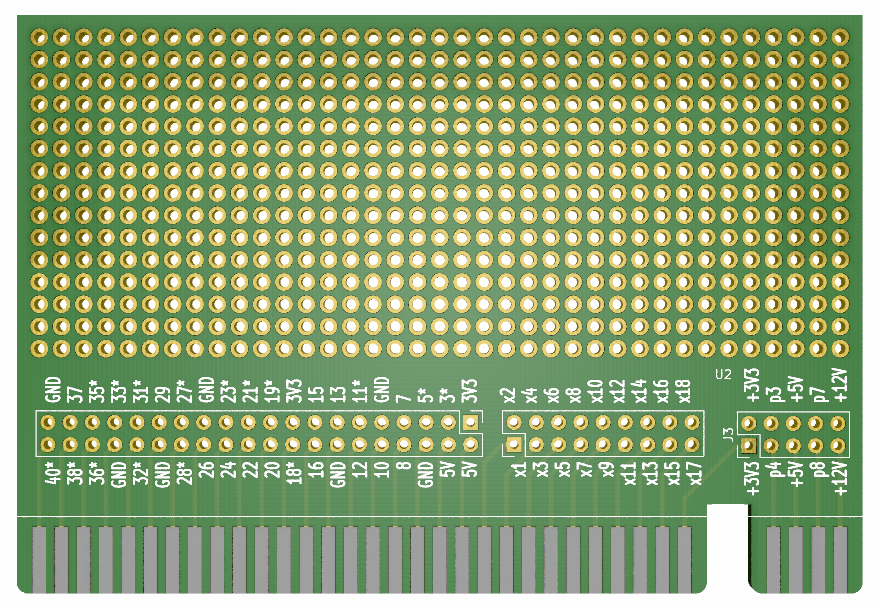
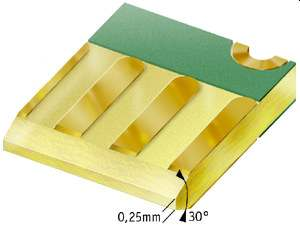

# CMM2-ExoansionCard-ProtoSimple
 

This is simple prototyping card with various signals exposed.

Expansion system and cards can be purchased here: [PS Labs](https://sklep.pslabs.pl/Maximite-c91)

Kicad project can be downloaded here:

[Kicad prototyping card](Kicad/proto_vard_simple/)

# WARNING!

Expansion card have to have edges chamfered, using unchamfered card will result in slot damage.